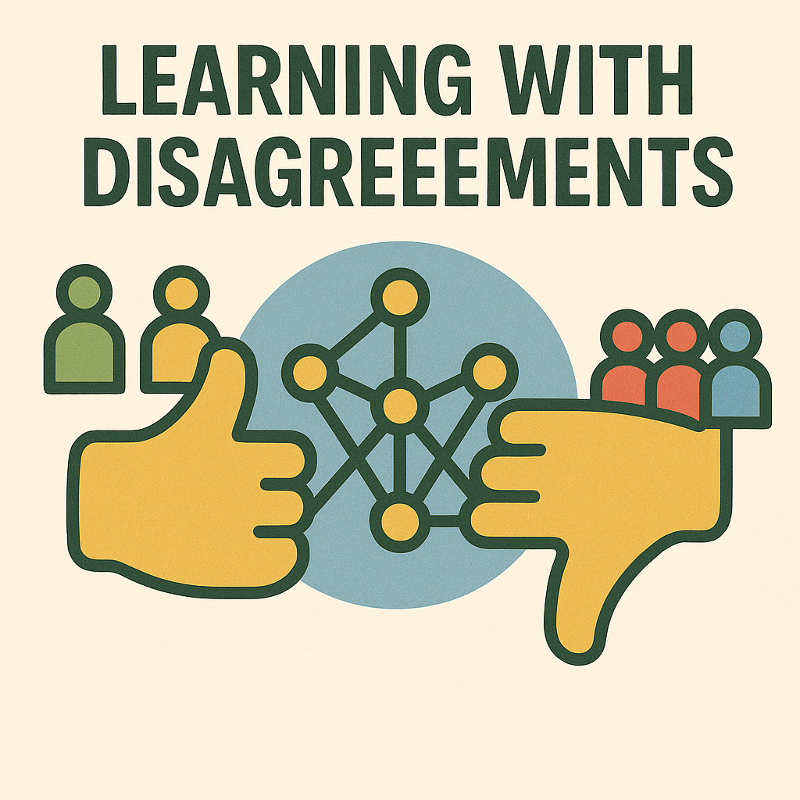

[LeWiDi 2023 - 2nd edition](/LeWiDi2023/) | [LeWiDi 2021 - 1st edition](https://sites.google.com/view/semeval2021-task12) 

### 👍👎 Updates 
# The official leaderboard of the LeWiDi 2025 Edition is now available at [this link](https://docs.google.com/spreadsheets/d/1mrJLaAIn60YTbYAVtRlwOqJktrxk252igoI2AT8UZuo/edit?gid=1049169550#gid=1049169550) ... see you in Suzhou!
# LeWiDi 3rd Edition shared task at the NLPerspectives Workshop is online! 
# Please check [our competition page on Codabench](https://www.codabench.org/competitions/7192/) for data and more information! 👍👍

### 👍👎 Overview
The third edition of Learning with Disagreements (LeWiDi) is co-located with the [NLPerspectives](https://nlperspectives.di.unito.it/) workshop at [EMNLP 2025](https://2025.emnlp.org/). 
The Shared Task aims to highlight the challenges posed by **interpretative variation** and to encourage the research community to engage with this issue. The main goal of the shared task is to provide a **unified testing framework for learning from disagreements and evaluating models** on such datasets.

The two previous editions of the shared task were organized as part of SEMEVAL: the first edition, (in [2021, Uma et al.](https://aclanthology.org/2021.semeval-1.41/)) focused on ambiguity in language and vision, while the second edition (in [2023, Leonardelli et al.](https://aclanthology.org/2023.semeval-1.314/)) concentrated on disagreement in subjective tasks.

This new edition will differ from the previous ones in a number of respects:

- It will include **new tasks** not included in previous editions, such as NLI detection, irony detection and conversational sarcasm detection;
- We will not use hard evaluation anymore -- but we will test **two approaches to soft evaluation**. The first is a version of the soft labeling approach used in LeWiDi 1 and 2, but using Manhattan distance instead of cross-entropy, as a result of the post-LeWiDi 2 analysis discussed in ([Rizzi et al, 2024](https://aclanthology.org/2024.nlperspectives-1.9.pdf)). The second is a form of perspectivist evaluation--instead of evaluating a model's ability to predict the distribution of labels over the population, we will test a system's ability to predict an annotator's bias.
- We will include two datasets in which values are on a **Likert scale**, raising further issues regarding evaluation with disagreement.

### 👍👎 The datasets
Each dataset includes annotated examples with soft labels generated from multiple annotators and corresponding annotator metadata.
Despite differing objectives, all datasets share a homogeneous JSON format.

#### Conversational Sarcasm Corpus (CSC)
The CSC is a dataset of context+response pairs rated for sarcasm, with ratings from 1 to 6.
The paper describing the dataset is available [here](https://aclanthology.org/2024.naacl-long.238/).

#### MultiPico dataset (MP)
The MP dataset is a crowdsourced multilingual irony detection dataset. Annotators were tasked to detect whether a reply was ironic in the context of a brief post-reply exchange on social media. Annotators ids and metadata (gender, age, nationality, etc) are available. Languages include Arabic, German, English, Spanish, French, Hindi, Italian, Dutch, and Portuguese.
The paper describing the dataset is available [here](https://aclanthology.org/2024.acl-long.849.pdf).

#### Paraphrase Detection dataset (Par)
A dataset of question pairs for which the annotators had to tell whether the two questions are paraphrases of each other, using values on a Likert scale.
Maintained by the [MaiNLP lab](https://mainlp.github.io/) (not yet published).

#### VariErr NLI dataset (VariErrNLI)
A dataset  originally designed for automatic error detection, distinguishing between annotation errors and legitimate human label variations in Natural Language Inference.
The paper describing the dataset is available [here](https://aclanthology.org/2024.acl-long.123/).

### 👍👎 Tasks and Evaluation

Only soft evaluation metrics will be used:

- **TASK A (SOFT LABEL PREDICTION):** Systems must output a probability distribution over labels.  
  **Evaluation:** Manhattan distance from the soft label distribution from annotators.
  
- **TASK B (PERSPECTIVIST PREDICTION):** Systems must predict individual annotators' labels.  
  **Evaluation:** Measures correctness of predictions per annotator.

Submissions can target one or both tasks. Participants may submit one or multiple datasets.

### 👍👎 Output of the shared task

Participants can submit a system paper to the 4th Workshop on Perspectivist Approaches to NLP. These peer-reviewed papers will be published in the workshop proceedings.

### 👍👎 Important dates
- Training data ready         May 1st 2025
- Evaluation Starts            June 15th 2025
- Evaluation Ends             July 10th 2025 AoE
- Paper submission due:   August 8th 2025 AoE (deadline extended!)
- Notification to authors:   August 25th 2025 AoE
- Camera ready due:        September 12th 2025 AoE
- NLPerspectives workshop:       November  8, 2025

